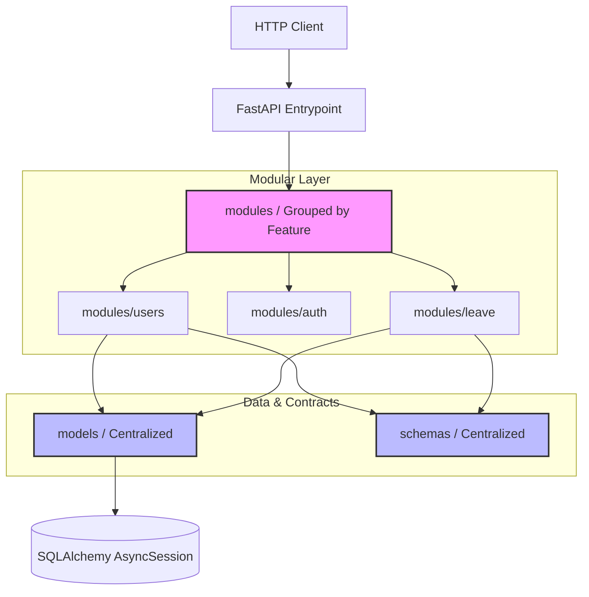

# 🏛️ HRMS - Enterprise Ledger & Backend Monolith

Welcome to the **HRMS (Human Resource Management System)** backend context! This project is a production-grade, highly modular asynchronous API application built with **FastAPI** and **SQLAlchemy (asyncio)**, structured as a **Semi-Modular Monolith**.

This architecture is optimized for scalability and team velocity as the HRMS domain expands to include Employees, Attendance, Leave, Tasks, Leads, and Announcements.

---

## 🎨 Architectural Design System: The Semi-Modular Monolith

To optimize for standard Python runtime imports while retaining strict Domain-Driven modularity (similar to NestJS), this project implements the **Semi-Modular Monolith** architecture:



### Why this architecture?
1. **Zero Circular Imports**: By keeping all SQLAlchemy ORM database models (`app/models/`) and validation schemas (`app/schema/`) centralized, we eliminate Python's runtime circular import limitations.
2. **High Domain Modularity**: Developers work in self-contained feature folders under `app/modules/`. Endpoints (`router.py`), business rules (`services.py`), database queries (`repos.py`), and local bindings (`dependencies.py`) are placed adjacently.
3. **OOP Contracts (Interfaces)**: Services and Repositories are decoupled via abstract interfaces using `abc.ABC` and `@abstractmethod`. This makes unit testing with mock databases trivial.

---

## 📂 Directory Layout

```ansi
app/
├── core/                        # Centralized application configs, logging, JWT security
├── database/                    # Database session context & migrations config
├── models/                      # Centralized SQLAlchemy Database models (Zero circular imports)
│   ├── users.py
│   └── otp_verification.py
├── schema/                      # Centralized Pydantic Validation models (Zero circular imports)
│   ├── users/
│   └── auth/
├── shared/                      # Shared global base classes, exceptions, and helpers
│   ├── base_repo.py             # Shared Base Repository
│   ├── base_service.py          # Shared Base Service
│   └── exceptions.py            # Centralized API Exception handlers
│
├── modules/                     # Modular Business Features
│   ├── users/
│   │   ├── interfaces/          # Domain Interfaces (Contracts)
│   │   │   ├── user_repo_interface.py
│   │   │   └── user_service_interface.py
│   │   ├── router.py            # API controller / Route endpoints
│   │   ├── services.py          # Concrete service implementation
│   │   ├── repos.py             # Concrete repository implementation
│   │   └── dependencies.py      # Dependency injection providers
│   │
│   └── auth/
│       ├── router.py
│       ├── services.py
│       ├── repos.py
│       └── dependencies.py
│
└── main.py                      # Application launchpad
```

---

## 🛠️ Technology Stack

* **Core Framework**: FastAPI (Asynchronous ASGI)
* **ORM Engine**: SQLAlchemy 2.0 (Asyncio / greenlet context)
* **Validation & Parsing**: Pydantic v2
* **Security & Auth**: JWT (JSON Web Tokens), secure HttpOnly cookies, and custom RBAC permission checkers

---

## 🚀 How to Add a New Domain Module (e.g., `leave`)

To extend the system and build new features, follow this step-by-step blueprint:

1. **Define Database Models**:
   Create the database table under `app/models/leave.py` and register it in `app/models/__init__.py`.
2. **Define Validation Schemas**:
   Create the Pydantic schemas under `app/schema/leave.py`.
3. **Create Module Folder**:
   Create `app/modules/leave/` and add the following files:
   * **`repos.py`**: Define `ILeaveRepo` (ABC) and concrete `LeaveRepo` implementing database methods.
   * **`services.py`**: Define `ILeaveService` (ABC) and concrete `LeaveService` implementing business rules.
   * **`dependencies.py`**: Add FastAPI dependencies to inject `LeaveRepo` and `LeaveService`.
   * **`router.py`**: Define the routes, security dependencies, and call service methods.
4. **Register Route**:
   Import and mount the router in `app/__init__.py`:
   ```python
   from app.modules.leave.router import router as leave_router
   app.include_router(leave_router, prefix="/api")
   ```
